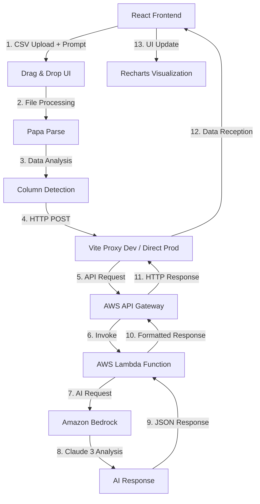

# マスタープロンプト - Strategic AI Platform

## 🎯 プロジェクト定義

**プロジェクト名**: Strategic AI Platform - 売上分析ツール  
**技術スタック**: React + TypeScript + Vite + AWS Bedrock + Vercel  
**開発方針**: アジャイル開発、MVP先行、継続的改善

## 🏗️ システムアーキテクチャ

### データフロー詳細



### API エンドポイント構成

```
AWS API Gateway: https://ylgrnwffx6.execute-api.us-east-1.amazonaws.com
├── POST / (メインエンドポイント)
│   ├── Request Body:
│   │   ├── prompt: string (ユーザー質問)
│   │   └── salesData: array (CSV データ最初50行)
│   └── Response:
│       ├── response: string (AI分析結果)
│       ├── message: string (システムメッセージ)
│       └── data: object (追加データ)
```

### Lambda 関数構成

```python
# 想定されるLambda関数構造
import boto3
import json

def lambda_handler(event, context):
    # 1. リクエスト解析
    body = json.loads(event['body'])
    prompt = body.get('prompt')
    sales_data = body.get('salesData')
    
    # 2. Bedrock クライアント初期化
    bedrock = boto3.client('bedrock-runtime')
    
    # 3. プロンプト構築
    enhanced_prompt = build_analysis_prompt(prompt, sales_data)
    
    # 4. Claude 3 呼び出し
    response = bedrock.invoke_model(
        modelId='anthropic.claude-3-sonnet-20240229-v1:0',
        body=json.dumps({
            'anthropic_version': 'bedrock-2023-05-31',
            'max_tokens': 2000,
            'messages': [{'role': 'user', 'content': enhanced_prompt}]
        })
    )
    
    # 5. レスポンス処理
    result = json.loads(response['body'].read())
    
    return {
        'statusCode': 200,
        'headers': {'Access-Control-Allow-Origin': '*'},
        'body': json.dumps({
            'response': result['content'][0]['text']
        })
    }
```

## 📋 開発ガイドライン

### フロントエンド開発原則

1. **TypeScript厳格モード**
   - すべての型定義を明確に
   - any型の使用禁止
   - interface定義の徹底

2. **React ベストプラクティス**
   - 関数コンポーネント使用
   - useStateでの状態管理
   - useEffectでの副作用処理

3. **UI/UX設計原則**
   - モバイルファースト
   - アクセシビリティ対応
   - 直感的操作

### バックエンド連携原則

1. **API通信**
   - Axiosによる型安全な通信
   - エラーハンドリングの徹底
   - ローディング状態管理

2. **データ処理**
   - CSV解析の堅牢性
   - 大容量ファイル対応
   - メモリ効率性

## 🎨 コンポーネント設計

### ディレクトリ構造

```
src/
├── components/          # 再利用可能コンポーネント
│   ├── FileUpload/     # ファイルアップロード
│   ├── Charts/         # グラフコンポーネント
│   └── UI/             # 基本UIコンポーネント
├── hooks/              # カスタムフック
├── utils/              # ユーティリティ関数
├── types/              # TypeScript型定義
└── services/           # API通信サービス
```

### 主要コンポーネント

```typescript
// ファイルアップロードコンポーネント
interface FileUploadProps {
  onFileUpload: (data: SalesData[]) => void;
  isLoading: boolean;
}

// グラフコンポーネント
interface ChartComponentProps {
  data: ChartData;
  type: 'line' | 'bar' | 'pie';
  title: string;
}

// AI分析コンポーネント
interface AIAnalysisProps {
  salesData: SalesData[];
  onAnalysisComplete: (result: string) => void;
}
```

## 🔧 開発環境設定

### 必須ツール
```bash
# Node.js 22.x
node -v  # v22.17.1

# パッケージ管理
npm -v   # 10.9.2

# 開発サーバー
npm run dev  # localhost:5174
```

### 環境変数
```env
# 開発環境
VITE_API_ENDPOINT=http://localhost:5174/api

# 本番環境
VITE_API_ENDPOINT=https://ylgrnwffx6.execute-api.us-east-1.amazonaws.com
```

## 📊 データ仕様

### CSV データ要件

```typescript
interface SalesData {
  [key: string]: string | number;
}

// 想定されるカラム
interface ExpectedColumns {
  date?: string;      // 日付カラム
  sales?: number;     // 売上カラム  
  product?: string;   // 商品カラム
  amount?: number;    // 金額カラム
  category?: string;  // カテゴリカラム
}
```

### API リクエスト形式

```typescript
interface APIRequest {
  prompt: string;              // ユーザー質問
  salesData?: SalesData[];     // 売上データ（最大50行）
  analysisType?: string;       // 分析タイプ
}

interface APIResponse {
  response: string;            // AI分析結果
  message?: string;            // システムメッセージ
  data?: any;                  // 追加データ
  error?: string;              // エラーメッセージ
}
```

## 🚀 デプロイメント

### Vercel 設定

```json
// vercel.json
{
  "framework": "vite",
  "buildCommand": "npm run build",
  "outputDirectory": "dist",
  "functions": {
    "app/api/**": {
      "runtime": "nodejs18.x"
    }
  }
}
```

### GitHub Actions
```yaml
# .github/workflows/deploy.yml
name: Deploy to Vercel
on:
  push:
    branches: [main]
jobs:
  deploy:
    runs-on: ubuntu-latest
    steps:
      - uses: actions/checkout@v3
      - uses: actions/setup-node@v3
      - run: npm ci
      - run: npm run build
      - uses: amondnet/vercel-action@v20
```

## 🎯 プロンプトテンプレート

### 売上分析用プロンプト

```typescript
const analysisPrompts = {
  trend: "この売上データの傾向を分析し、主要なトレンドと要因を説明してください。",
  prediction: "過去のデータから今後3ヶ月の売上予測を行ってください。",
  seasonality: "売上の季節性パターンを分析し、ビジネスへの影響を評価してください。",
  anomaly: "売上データの異常値を検出し、原因分析を行ってください。",
  product: "商品別の売上パフォーマンスを比較分析してください。"
};
```

### Bedrock プロンプト構築

```python
def build_analysis_prompt(user_prompt, sales_data):
    return f"""
あなたは売上データ分析の専門家です。以下の売上データを分析し、ユーザーの質問に回答してください。

【売上データ】
{json.dumps(sales_data, ensure_ascii=False, indent=2)}

【質問】
{user_prompt}

【回答要件】
1. データの傾向と特徴を明確に示す
2. 具体的な数値と根拠を含める
3. ビジネスへの影響と推奨アクションを提示
4. 可能であればリスクと機会を指摘
5. 回答は日本語で、分かりやすく構造化する

【回答】
"""
```

## 📋 開発タスク管理

### 継続的改善項目

1. **パフォーマンス最適化**
   - バンドルサイズ削減
   - レンダリング最適化
   - API レスポンス時間短縮

2. **ユーザビリティ向上**
   - エラーメッセージ改善
   - ローディング状態可視化
   - 操作フィードバック強化

3. **機能拡張**
   - 複数ファイル対応
   - データフィルタリング
   - カスタムグラフ作成

4. **品質保証**
   - ユニットテスト追加
   - E2Eテスト実装
   - セキュリティ監査

## 🔍 トラブルシューティング

### よくある問題と解決策

1. **CORS エラー**
   - 開発環境: Viteプロキシ設定確認
   - 本番環境: API Gateway CORS設定

2. **ファイルアップロード失敗**
   - ファイル形式確認
   - ファイルサイズ制限
   - エンコーディング問題

3. **グラフ表示されない**
   - データ形式検証
   - Rechartsバージョン確認
   - ブラウザ互換性

---

**作成日**: 2025年8月18日  
**最終更新**: 2025年8月18日  
**バージョン**: 1.0