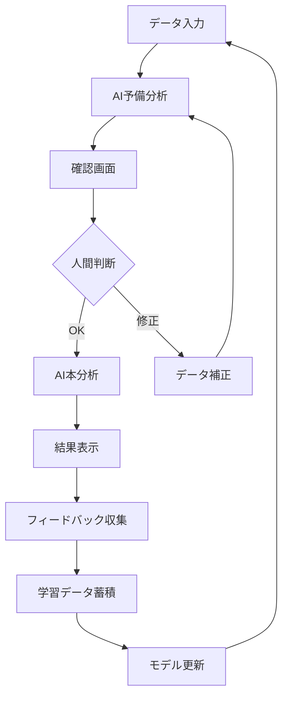

# 将来構想 - 企業統合管理プラットフォーム

## 🎯 ビジョン

**「使うほど賢くなる、企業専用AI分析プラットフォーム」**

本プロジェクトは売上分析ツールから始まり、最終的に企業の全業務を統合的に管理・分析する進化型AIプラットフォームへと発展させます。Human in the Loopによる継続的学習により、各企業に特化したカスタマイズを実現します。

## 🏗️ プラットフォーム全体構成

### Core Philosophy: Human in the Loop
```
データ入力 → AI予備分析 → 人間確認 → AI本分析 → 結果提示 → フィードバック → 学習更新
     ↑                                                                    ↓
     └──────────────────── 継続的改善サイクル ────────────────────────┘
```

## 📊 統合管理モジュール

### 1. 売上分析モジュール（現在開発中）
**現在の状況**: MVP完成、Human in the Loop実装予定

**機能**
- CSV/Excel売上データアップロード
- 自動データ可視化（グラフ・チャート）
- AI売上トレンド分析
- 予測・推奨アクション提示

**Human in the Loop**
- データ項目確認「この売上データの解釈は正しいですか？」
- 分析結果検証「この傾向分析は実情に合っていますか？」
- カスタマイズ「御社特有の季節要因はありますか？」

### 2. 報告書管理モジュール（予定）
**目標**: 企業内レポート作成・管理の自動化

**機能**
- 月次・四半期レポート自動生成
- 部門別パフォーマンス分析
- 経営ダッシュボード
- PDF/Excel出力

**Human in the Loop**
- レポート内容確認「この数値解釈で正しいですか？」
- 重要指標設定「御社で最重視するKPIは何ですか？」
- 文書スタイル学習「御社の報告書スタイルを学習します」

### 3. 顧客管理モジュール（予定）
**目標**: 顧客とのやり取り最適化・関係性強化

**機能**
- 顧客対応履歴管理
- 顧客満足度分析
- 商談進捗トラッキング
- 自動フォローアップ提案

**Human in the Loop**
- 顧客分類確認「このお客様の重要度分類は適切ですか？」
- 対応方針検証「この顧客への提案は適切ですか？」
- 成功パターン学習「この案件が成功した要因は何ですか？」

### 4. プロジェクト進捗管理モジュール（予定）
**目標**: 工事・プロジェクトの効率的進行管理

**機能**
- プロジェクト進捗可視化
- リソース配分最適化
- リスク予測・早期警告
- 完了予測・スケジュール調整

**Human in the Loop**
- 進捗評価確認「この進捗評価は現場感覚と合っていますか？」
- リスク要因特定「この遅延要因は妥当ですか？」
- 改善策検証「この対策は実現可能ですか？」

## 🧠 Human in the Loop 詳細設計

### フィードバックループ構造



### 段階的学習システム

**Level 1: データ理解学習**
- カラム名の意味理解
- データ形式の認識
- 業界特有の用語学習

**Level 2: 分析精度向上**
- 企業固有の傾向認識
- 季節性・周期性の学習
- 異常値の文脈理解

**Level 3: 提案カスタマイズ**
- 企業文化に合った提案スタイル
- 実行可能性を考慮した推奨事項
- 過去の成功パターン活用

### フィードバック収集インターフェース

```typescript
interface HumanFeedback {
  sessionId: string;
  moduleType: 'sales' | 'reports' | 'customers' | 'projects';
  stage: 'data_confirmation' | 'analysis_review' | 'result_evaluation';
  
  // データ確認段階
  dataConfirmation?: {
    isAccurate: boolean;
    corrections: ColumnMapping[];
    additionalContext: string;
  };
  
  // 分析結果評価
  analysisReview?: {
    accuracy: number; // 1-5スケール
    relevance: number; // 1-5スケール
    actionability: number; // 1-5スケール
    comments: string;
  };
  
  // 結果活用評価
  resultEvaluation?: {
    implemented: boolean;
    effectiveness: number; // 1-5スケール
    businessImpact: string;
    improvements: string;
  };
}
```

## 🚀 開発ロードマップ

### Phase 1: Human in the Loop基盤実装（1-2週間）
- [x] 売上分析モジュール基本機能
- [ ] データ確認画面実装
- [ ] フィードバック収集UI
- [ ] 学習データ蓄積システム

### Phase 2: 売上分析モジュール完成（2-4週間）
- [ ] 高度な分析機能（予測・異常検知）
- [ ] カスタマイズエンジン
- [ ] パフォーマンス最適化
- [ ] エンタープライズ機能

### Phase 3: 報告書管理モジュール（1-2ヶ月）
- [ ] レポート自動生成
- [ ] テンプレートエンジン
- [ ] Human in the Loop統合
- [ ] 既存システム連携

### Phase 4: 顧客管理モジュール（2-3ヶ月）
- [ ] CRM基本機能
- [ ] 顧客分析AI
- [ ] コミュニケーション最適化
- [ ] 営業支援機能

### Phase 5: プロジェクト管理モジュール（2-3ヶ月）
- [ ] 進捗管理システム
- [ ] リソース最適化
- [ ] リスク予測機能
- [ ] 統合ダッシュボード

### Phase 6: プラットフォーム統合（1ヶ月）
- [ ] モジュール間連携
- [ ] 統一UI/UX
- [ ] 総合分析機能
- [ ] エンタープライズセキュリティ

## 💡 技術的な進化

### AI/ML 技術スタック拡張

**現在**: Amazon Bedrock Claude 3
**将来**:
- 企業特化Fine-tuningモデル
- RAG（Retrieval-Augmented Generation）
- 多モーダル分析（テキスト・画像・音声）
- 予測モデリング（時系列・回帰）

### データ基盤強化

**現在**: CSV/Excel単発処理
**将来**:
- データウェアハウス（Amazon Redshift/BigQuery）
- リアルタイムデータパイプライン
- データレイク統合
- API連携（ERP・CRM・会計システム）

### セキュリティ・コンプライアンス

**現在**: 基本HTTPS通信
**将来**:
- SOC2 Type2認証
- GDPR/個人情報保護法対応
- 企業内VPN対応
- 監査ログ・アクセス制御

## 🎯 ビジネスモデル展開

### 段階的価格設定

**Starter** (現在のMVP)
- 売上分析のみ
- 月額 ¥10,000
- Small Business向け

**Professional**
- 売上分析 + 報告書管理
- Human in the Loop機能
- 月額 ¥50,000
- Medium Business向け

**Enterprise**
- 全モジュール統合
- カスタマイズ・導入支援
- 月額 ¥200,000+
- Large Enterprise向け

### 成功指標（KPI）

**技術的KPI**
- AI分析精度: >90%
- ユーザー満足度: >4.5/5
- システム稼働率: >99.9%

**ビジネスKPI**
- 顧客継続率: >95%
- 年間売上成長率: >200%
- 市場シェア: 業界トップ3

## 🌟 競合優位性

### 1. Human in the Loop差別化
既存のBIツールやAI分析ツールは一方向的な分析が多い中、継続的学習により企業特化カスタマイズを実現

### 2. 統合プラットフォーム
個別ツールの組み合わせではなく、設計段階から統合を前提とした一元管理

### 3. 中小企業フォーカス
大企業向け高額ツールではなく、中小企業でも導入可能な価格設定とUI設計

### 4. 日本企業特化
日本の商習慣・業界特性を理解したAI分析とインターフェース

## 📈 期待される効果

### 企業への価値提供

**効率性向上**
- レポート作成時間: 80%削減
- データ分析工数: 70%削減
- 意思決定速度: 3倍向上

**精度向上**
- 予測精度: 従来比30%向上
- 人的ミス: 90%削減
- データドリブン意思決定: 100%

**競争力強化**
- 市場対応速度向上
- 顧客満足度向上
- 収益性改善

---

**作成日**: 2025年8月18日  
**最終更新**: 2025年8月18日  
**バージョン**: 1.0  
**ステータス**: 将来構想・開発計画